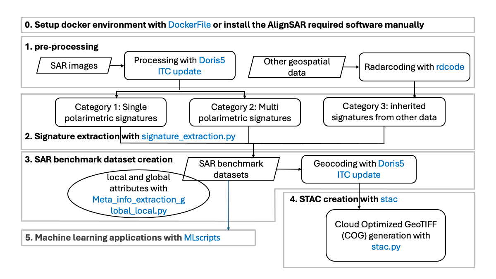

## Summary

Benchmark datasets are essential for the development, evaluation, and comparison of machine learning models. However, in the field of Synthetic Aperture Radar (SAR) remote sensing [@curlander1991synthetic], there is a notable lack of large and standardized benchmark datasets, as reported by [@long2021creating], [@zhu2021deep]. Moreover, there is currently no open reference library of methods and tools for creating SAR benchmark datasets. To address these gaps, we developed AlignSAR, a comprehensive toolbox designed to create benchmark datasets specifically from SAR imagery, optimized for machine learning applications.

AlignSAR enables users to process both legacy and contemporary SAR datasets, including those from Envisat, Radarsat, and Sentinel-1, facilitating the extraction of representative SAR signatures. Additionally, the toolbox supports the alignment of other geospatial observations, such as LiDAR and optical satellite data, onto SAR reference grids, thereby enriching each SAR pixel with additional signatures. The SAR benchmark datasets created with AlignSAR, constructed from these enriched and aligned signatures, are then ready for use in a variety of machine-learning tasks and can be shared easily on the Cloud, e.g. by using STAC (SpatioTemporal Asset Catalogs).

## Statement of Need

SAR techniques, including InSAR (Interferometric SAR) [@bamler1998synthetic] and PolSAR (Polarimetric SAR) [@lee2017polarimetric], are well-established and are employed in natural and anthropogenic hazard monitoring, as well as land use and land cover classification. These techniques typically employ conventional methods such as persistent scatterer interferometry and the small baseline subset approach [@ferretti2001permanent], [@lanari2004small], recently in conjunction with machine learning techniques. A variety of commercial and open-source processing tools have been developed to support different SAR applications. For instance, The ESA SentiNel Application Platform  [SNAP](https://earth.esa.int/eogateway/tools/snap), a JAVA-based tool, which contains the Sentinel-1 Toolbox that is commonly used for standard InSAR and PolSAR decomposition analysis. [Doris](https://github.com/TUDelftGeodesy/Doris), stands for Delft object-oriented radar interferometric software, and is another open-source tool designed for InSAR analysis, though it is somewhat outdated and has been partially deprecated. On the commercial side, [Gamma](https://www.gamma-rs.ch/software) offers a robust solution for InSAR analysis, also integrated into platforms like [ASF Services – On Demand Processing](https://asf.alaska.edu/asf-services-hyp3-processing/) and [COMET LiCSAR System](https://comet.nerc.ac.uk/comet-lics-portal/). 

As an increasing number of dedicated SAR missions are launched, the community of SAR users is expanding, with growing interest in applying SAR data within machine learning frameworks [@zhu2021deep], [@kulshrestha2022use], [@ma2024despeckling]. Despite this trend, the aforementioned tools are not specifically designed for machine learning applications. Furthermore, directly applying methods developed for other types of signals and images to SAR data, without considering SAR representative signatures, can lead to biased and inaccurate machine learning outcomes. 

AlignSAR toolbox developed new methods and tools upon existing tools such as Doris and SNAP, and enhances the functionalities, optimizes key processes, and extends the capabilities of the tools used, see the details in [Main Functionalities](#Main Functionalities). It standardizes the extraction procedure of representative SAR signatures, and provides radar- and geo-coded geospatial observations that are all aligned onto SAR reference coordinates and then associates additional signatures from these geospatial data with the corresponding SAR pixels. The SAR signatures are classified into three categories:  

Category 1: Single polarimetric signatures, like amplitude, intensity, backscatter coefficient, interferometric and SLC (Single Look Complex) phase and coherence;  
Category 2: Multi polarimetric signatures, such as co-, dual polarization cross product, and summation, difference and ratio of the co-, dual, quad polarization intensities, and entropy, scattering mechanisms, SAR vegetation index (RVI), and SAR soil moisture.  
Category 3: Inherited attributes from additional geospatial observations, e.g. land use land cover type, cadastral features, temperature, atmospheric phase, and geological information. 

## Source Code and Tutorial

AlignSAR is available as an Apache-2.0-licensed open-source toolbox hosted on [GitHub](https://github.com/AlignSAR/alignSAR). The [AlignSAR tutorial](https://github.com/AlignSAR/alignSAR/blob/main/AlignSAR_tutorial.pdf) outlines the methodology and functionality structure employed in this project, describes all the open-source tools developed within this toolbox, and uses a use case with [Sentinel-1 SAR](https://www.esa.int/Applications/Observing_the_Earth/Copernicus/Sentinel-1) and [TOP10NL](https://www.pdok.nl/introductie/-/article/basisregistratie-topografie-brt-topnl) data for demonstration. 

## Main Functionalities and Processing Flowchart

1. [itc-doris_5_patch2023](https://github.com/AlignSAR/alignSAR/tree/main/itc-doris_5_patch2023): an updated version of Doris that is used to read raw SAR (Single Look Complex format), coregister all SAR images to the same reference grids, resample them, remove the reference and topographic phase using external Digital Elevation Model (DEM) (e.g [SRTM](https://www.earthdata.nasa.gov/sensors/srtm#:~:text=The%20Shuttle%20Radar%20Topography%20Mission,global%20dataset%20of%20land%20elevations.) or [Copernicus DEM](https://spacedata.copernicus.eu/collections/copernicus-digital-elevation-model)), and generate co-registered amplitude, SLC phase and interferometric phase data.

2. [jupyter_notebook_demo](https://github.com/AlignSAR/alignSAR/tree/main/jupyter_notebook_demo): a jupyter notebook to demonstrate how to extract, visualize and analyse SAR signatures, with the sample output generated by Doris.

3. [rdcode](https://github.com/AlignSAR/alignSAR/tree/main/rdrcode): the radarcoding scripts to align other geospatial data onto SAR reference grid. For method details refer to [@Kulshresta2023].

4. [snap_graphs](https://github.com/AlignSAR/alignSAR/tree/main/snap_graphs): graphs for SNAP used within the toolbox (e.g. rdr<->geocode).

5. [stac](https://github.com/AlignSAR/alignSAR/tree/main/stac): python scripts to create STAC (SpatioTemporal Asset Catalogs). Our STAC examples are available via [STAC Browser](https://radiantearth.github.io/stac-browser/#/?.language=en) by specifying the STAC Catalog with 'https://data.crib.utwente.nl/stac/alignsar/catalog.json'.
   
6. [DockerFile](https://github.com/AlignSAR/alignSAR/blob/main/DockerFile): docker file with OS and software setup. Note that another docker file with Doris-5 installed is in itc-doris_5_patch2023, with the same name DockerFile but different software setup.

7. [Meta_info_extraction_global_local.py](https://github.com/AlignSAR/alignSAR/blob/main/Meta_info_extraction_global_local.py): a script to extract global/local attributes from Sentinel-1 SAR metadata.

8. [signature_extraction.py](https://github.com/AlignSAR/alignSAR/blob/main/signature_extraction.py): a script to extract representative SAR signatures.

9. [speckle_filt.py](https://github.com/AlignSAR/alignSAR/blob/main/speckle_filt.py): a script for spatio-temoporal speckle filtering. For more details, refer to [@Quegan2001].

10. [MLscripts](https://github.com/AlignSAR/alignSAR/tree/main/MLscripts): scripts for machine learning analysis. [Yolov8](https://github.com/ultralytics/ultralytics), ANN (Artificial Neural Network) and Siamese are separately used for Object Detection (India), Land Use Land Cover classification (Netherlands), and Change Detection (Poland). 

Figure 1 illustrates the processing flowchart for creating SAR benchmark datasets, with key functionalities highlighted in blue. The flowchart consists of six main stages: environment and software setup, pre-processing, signature extraction, SAR benchmark dataset generation, STAC creation, and machine learning application demonstration.
 

Figure 1: Processing flowchart

## Acknowledgements

The authors extend sincere gratitude to the ESA (European Space Agency) for funding the development of AlignSAR through the Open SAR Library project (4000140600/23/I-DT) and the ESA Network of Resources . We also thank all project members, listed on https://www.alignsar.nl/alignsar-team/ for their invaluable contributions to the development, testing and demonstration of the methods in this project. 

## References
